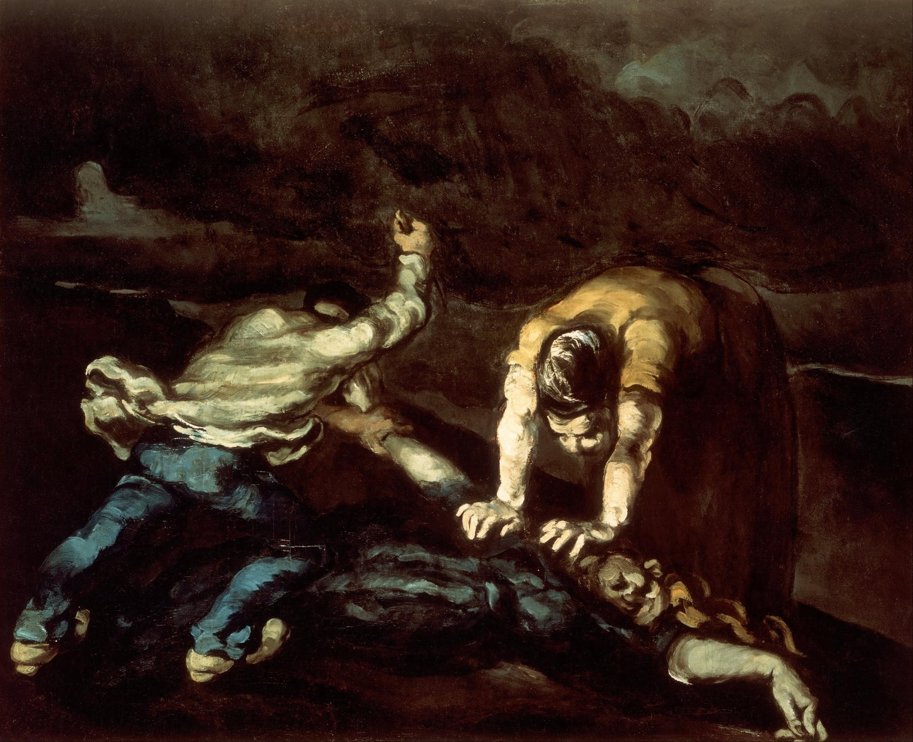
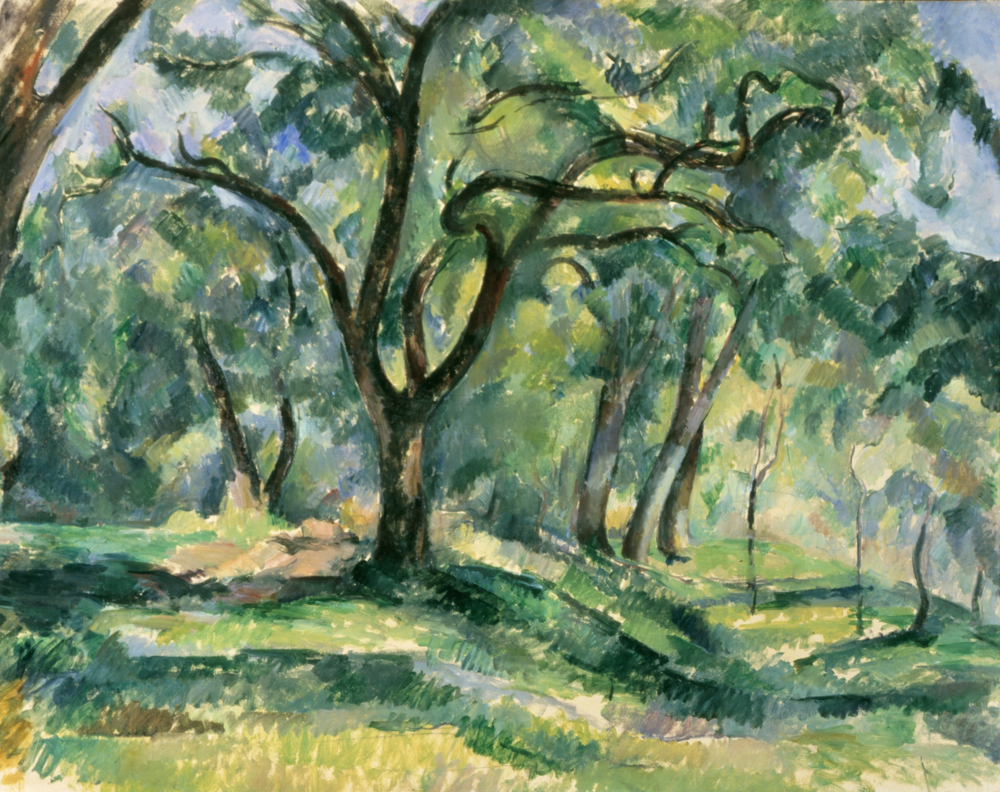

# cezanne-salon

Benchmarking Flux.1 against Cézanne's three periods.

---

## Reference Paintings

<table>
<tr>
<td align="center" width="25%"><br/><b>The Murder</b><br/><i>Early</i></td>
<td align="center" width="25%"><br/><b>The Card Players</b><br/><i>Middle</i></td>
<td align="center" width="25%"><br/><b>Fruit Bowl, Glass and Apples</b><br/><i>Middle</i></td>
<td align="center" width="25%"><br/><b>The Forest</b><br/><i>Late</i></td>
</tr>
</table>


---

## Thesis

Most image generation benchmarks test against photographs, product images, or generic creative prompts. None of them test whether a model understands what makes a Cézanne from 1867 structurally different from one painted in 1904. This benchmark does.

Cézanne's career moves across three philosophically distinct phases. His Early period is dark, emotional, and influenced by the Romantic tradition. His Middle period is structured, geometric, and theoretically rigorous. His Late period abandons three-dimensional space almost entirely, flattening planes into a proto-Cubist perceptual experiment. A model that genuinely understands his work should fail differently across these three periods. Tracking that failure is the point.

---

## Paintings Selected

| Period | Painting | Year | Why |
|--------|----------|------|-----|
| Early (1859-1875) | The Murder | 1867 | Dark romantic, violent, unambiguously Early |
| Middle (1875-1890) | The Card Players | 1892 | Geometric figures, muted palette, peak Cézanne the theorist |
| Middle (1875-1890) | Fruit Bowl, Glass and Apples | 1880 | Intentional geometric distortion, proto-Cubism in a still life |
| Late (1890-1906) | The Forest | 1904 | Near-total abstraction, flattened planes, maximum stress test |

The Middle period carries two paintings. Still life and figure painting require different model competencies, and the Middle period is Cézanne's most theoretically rich phase.

---

## Model and Setup

**Model:** Flux.1-dev Q4_K_S (GGUF quantized)
**Platform:** ComfyUI on M4 Mac, 24GB unified memory
**Sampler:** Euler | **CFG:** 1.0 | **Steps:** 10 | **Resolution:** 512x512

Benchmarking runs use randomized seeds to capture variance. Low step count and resolution are intentional for iteration speed. More in depth renders at 1024x1024 and 20 steps in the future.
---

## Rubric

Each output is scored 1-5 across five dimensions:

**Palette accuracy:** earth tones, warmth/coolness, and saturation relative to the target period.
**Brushwork visibility:** impasto texture, stroke character, and paint handling quality.
**Planarity:** how flat and abstracted the forms are. Early Cézanne is relatively three-dimensional. Late Cézanne is almost entirely flat. This is the core degradation metric.
**Compositional structure:** geometric blocking, horizon placement, and spatial logic.
**Edge quality:** hard in Early, structured in Middle, dissolved in Late.

Full scoring data and qualitative notes per run are in `benchmark.md`.

---

## Preliminary Findings

### The Murder (Early Period, 1867)

Flux.1 can generate violent figurative scenes. It cannot generate Cézanne's violent figurative scenes.

Across five runs with progressively refined prompts, the model consistently defaulted to cinematic, photorealistic rendering. Run 1 produced a Neoclassical wrestling scene. Runs 2 through 4, with increasingly specific negative prompting against Baroque and photographic styles, produced what can best be described as a Victorian film still. Run 5, which led entirely with medium description rather than subject description, showed marginal improvement in painterly texture but did not break the underlying pattern.

 Flux's training distribution for clothed figurative violence is overwhelmingly photographic and cinematic. The model knows what a murder looks like. It does not know what Cézanne's decision to paint a murder crudely, emotionally, and against academic convention looks like.

## Status

- [x] Early: The Murder (5 runs)
- [ ] Middle: The Card Players
- [ ] Middle: Fruit Bowl, Glass and Apples
- [ ] Late: The Forest

---

## Structure

```
cezanne-salon/
├── README.md
├── benchmark.md
└── images/
    ├── reference/
    └── early/
```

---

*Flux.1-dev Q4_K_S. ComfyUI. M4 Mac. March 2026.*
