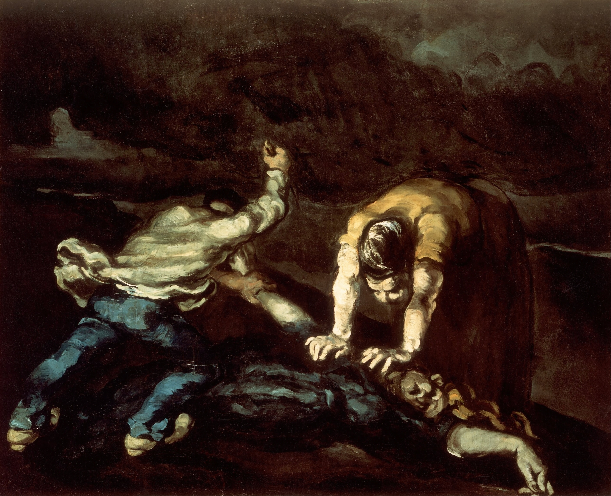
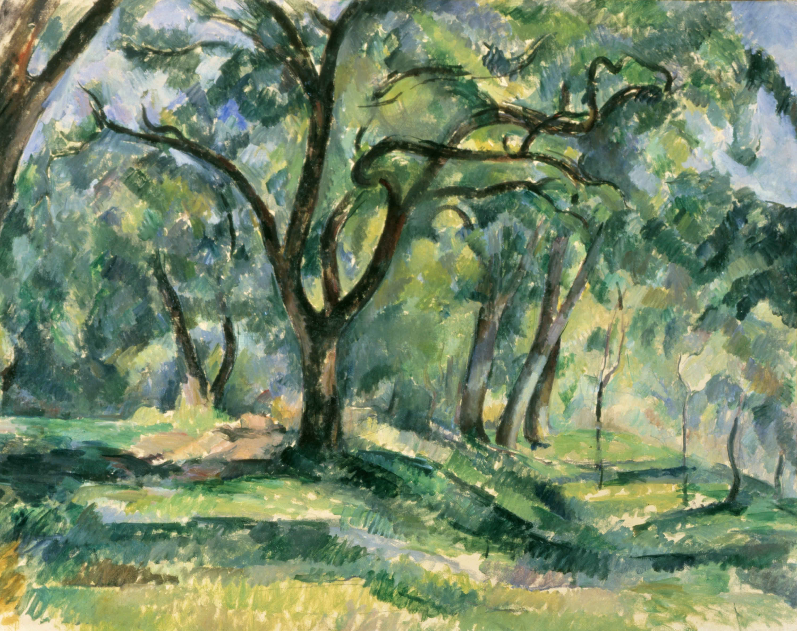

# cezanne-salon

Benchmarking Flux.1 against Cézanne's three periods.

---

## Reference Paintings

<table>
<tr>
<td align="center" width="25%"><br/><b>The Murder</b><br/><i>Early</i></td>
<td align="center" width="25%"><br/><b>The Card Players</b><br/><i>Middle</i></td>
<td align="center" width="25%"><br/><b>Fruit Bowl, Glass and Apples</b><br/><i>Middle</i></td>
<td align="center" width="25%"><br/><b>The Forest</b><br/><i>Late</i></td>
</tr>
</table>


---

## Thesis

Most image generation benchmarks test against photographs, product images, or generic creative prompts. None of them test whether a model understands what makes a Cézanne from 1867 structurally different from one painted in 1904. This benchmark does.

Cézanne's career moves across three philosophically distinct phases. His Early period is dark, emotional, and influenced by the Romantic tradition. His Middle period is structured, geometric, and theoretically rigorous. His Late period abandons three-dimensional space almost entirely, flattening planes into a proto-Cubist perceptual experiment. A model that genuinely understands his work should fail differently across these three periods. 

---

## Paintings Selected

| Period | Painting | Year | Why |
|--------|----------|------|-----|
| Early (1859-1875) | The Murder | 1867 | Dark romantic, violent, unambiguously Early |
| Middle (1875-1890) | The Card Players | 1892 | Geometric figures, muted palette, peak Cézanne the theorist |
| Middle (1875-1890) | Fruit Bowl, Glass and Apples | 1880 | Intentional geometric distortion, proto-Cubism in a still life |
| Late (1890-1906) | The Forest | 1904 | Near-total abstraction, flattened planes, maximum stress test |

The Middle period carries two paintings. Still life and figure painting require different model competencies, and the Middle period is Cézanne's most theoretically rich phase.

---

## Model and Setup

**Model:** Flux.1-dev Q4_K_S (GGUF quantized)
**Platform:** ComfyUI on M4 Mac, 24GB unified memory
**Sampler:** Euler | **CFG:** 1.0 (baseline), 2.0 (Card Players Run 3+) | **Steps:** 10 | **Resolution:** 512x512

Benchmarking runs use randomized seeds to capture variance. Low step count and resolution are intentional for iteration speed. More in depth renders at 1024x1024 and 20 steps in the future.

---
---

## Rubric

Each output is scored 1-5 across five dimensions:

**Palette accuracy:** earth tones, warmth/coolness, and saturation relative to the target period.
**Brushwork visibility:** impasto texture, stroke character, and paint handling quality.
**Planarity:** how flat and abstracted the forms are. Early Cézanne is relatively three-dimensional. Late Cézanne is almost entirely flat. This is the core degradation metric.
**Compositional structure:** geometric blocking, horizon placement, and spatial logic.
**Edge quality:** hard in Early, structured in Middle, dissolved in Late.

Full scoring data and qualitative notes per run are in `benchmark.md`.

---

## Findings

### The Murder (Early Period, 1867)

Flux.1 can generate violent figurative scenes. It cannot generate Cézanne's violent figurative scenes.

Across five runs with progressively refined prompts, the model consistently defaulted to cinematic, photorealistic rendering. Run 1 produced a Neoclassical wrestling scene. Runs 2 through 4, with increasingly specific negative prompting against Baroque and photographic styles, produced what can best be described as a Victorian film still. Run 5, which led entirely with medium description rather than subject description, showed marginal improvement in painterly texture but did not break the underlying pattern.

Flux's training distribution for clothed figurative violence is overwhelmingly photographic and cinematic. The model knows what a murder looks like. It does not know what Cézanne's decision to paint a murder crudely, emotionally, and against academic convention looks like.

### The Card Players (Middle Period, 1892)

Where the Murder benchmark exposed Flux's photorealism bias for figurative violence, the Card Players benchmark exposes something sharper: Flux can replicate Cézanne's iconography but cannot replicate his technique.

Across five runs, the model successfully converged on every object-level element of the painting — the two figures, the wine bottle centered between them, the ochre tablecloth with visible folds, the tall bowler hat, the wide-brimmed tan hat, the clay pipe, the warm reddish-brown tavern interior with hanging drapery. By Run 5, every iconographic element of Cézanne's composition was present and correctly placed.

What the model could not do, across any of the five runs, was render the figures the way Cézanne rendered them. The bodies in every output are fully three-dimensional, with fabric folds, rounded shoulders, and atmospheric modeling, despite increasingly aggressive prompting toward planar reduction. Three separate prompt strategies were attempted: explicit geometric description, negative prompting, and material/process language. All three failed. The bodies remained 3D. The same pattern held for broken color, Cézanne's signature technique of placing small unblended patches of distinct color next to each other rather than blending them into gradients. Three runs with progressively concrete prompt language produced no visible patch-mosaic effect in any output.

The Card Players benchmark also produced one methodological discovery: Flux at CFG 1.0 (its default) underweights painterly technique prompts to the point of ignoring them entirely. Bumping CFG to 2.0 in Run 3 produced an immediate category-level shift in how the model engaged with technique language. Faces moved from photorealistic to painterly, and surface texture appeared for the first time across the entire canvas. The implication is that benchmarking Flux's painterly capability at default CFG underestimates the model's ceiling. Future runs across all periods should test at minimum CFG 1.0 and 2.0 to separate "model can't" from "model won't at default settings."

The deeper finding is structural. Flux can replicate what a Cézanne painting *contains* but not how Cézanne *constructs* it. The model can dress an image up with Cézanne's iconography — the right objects, the right palette, the right composition — but cannot perform Cézanne's structural project, which is the planar reduction of three-dimensional form. That structural project is precisely what makes a Cézanne distinctly Cézanne rather than a generic 19th century genre painting.

### Fruit Bowl, Glass and Apples (Middle Period, 1880)

The Murder showed Flux defaulting to photorealism for figurative violence. The Card Players showed Flux replicating iconography but not technique. The still life sharpens the finding into something stranger: Flux defaults to competent realism and resists Cézanne's anti-realism by one of two routes, depending on how the prompt is phrased, and the prettier the output gets, the further from Cézanne it lands.

Across five runs, object convergence was never the problem. Flux renders the compote, the apples, the grapes, the glass, and the draped cloth reliably and, with a rich enough prompt, beautifully. The problem is everything that makes the painting a Cézanne. The instructions that would push the image toward his tilted tabletop, flattened space, broken color, and dark contour outlines either collapse the generation or get silently ignored.

Abstract or contradictory geometry — "planes flattened toward the picture surface," "the table seen from two angles at once" — drove the model into non-convergence, producing blank or near-blank canvases. A concrete, physically possible version of the same idea — "steeply tilted tabletop seen from a high angle" — rendered a clean image but with the instruction dropped, the table sitting in honest perspective regardless. Either way the still life lands on competent realism. The distortion that defines the painting cannot be obtained: abstract phrasing breaks the image, concrete phrasing is discarded.

Pushed hard with stacked anti-realist and texture language ("crude, flat, distorted, unfinished, raw impasto, broken color patches"), the model abandoned the scene entirely and resolved to a field of dark green and ochre color blocks — Cézanne's surface qualities present, the still life gone. Stripped back to a clean descriptive prompt, the model produced the sharpest, most beautiful render of the session: smooth volumetric apples, a flawless rounded bowl in correct perspective, conventional lighting, and despite the prompt explicitly asking for impasto and broken color, a smooth blended surface with none of it. The first image is texture without a subject. The second is a subject without technique. There is no setting in between that yields a coherent scene and Cézanne's structure.

Across all three paintings: Flux is fluent in representational competence and structurally incapable of Cézanne's anti-representational project. Flux can give you Cézanne's surface or a coherent scene, and the harder you push for the surface-plus-structural-distortion combination that is Cézanne, the more it has to throw away the scene to comply.

## Status

- [x] Early: The Murder (5 runs)
- [x] Middle: The Card Players (5 runs)
- [x] Middle: Fruit Bowl, Glass and Apples (5 runs)
- [ ] Late: The Forest

---

## Structure

```
cezanne-salon/
├── README.md
├── benchmark.md
└── images/
    ├── reference/
    ├── early/
    └── middle/
```

*Flux.1-dev Q4_K_S. ComfyUI. M4 Mac. March 2026 - May 2026.*
